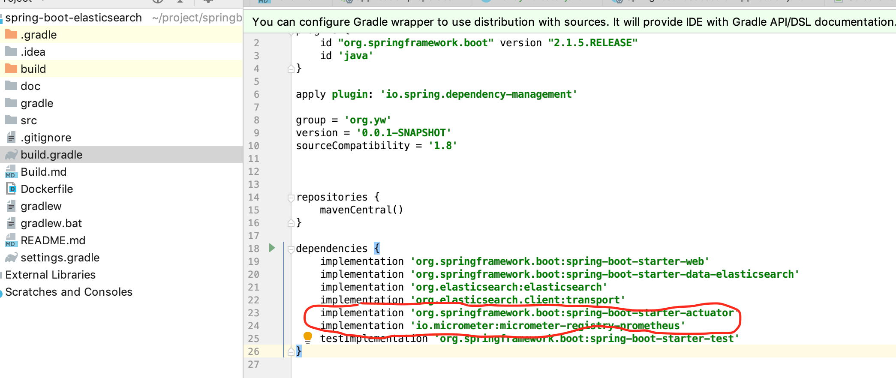
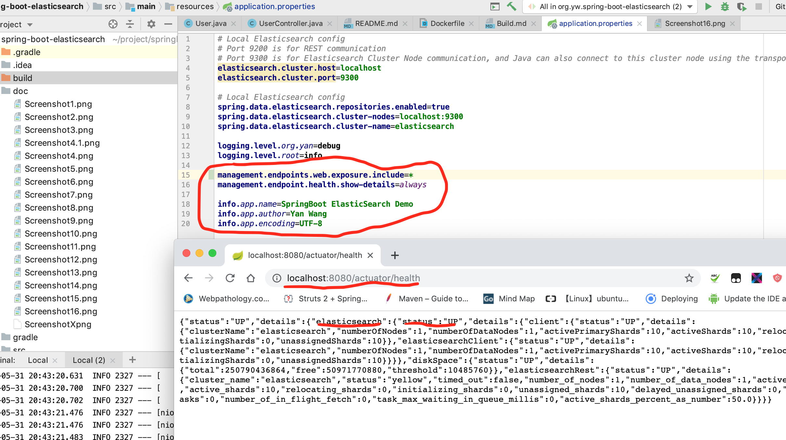
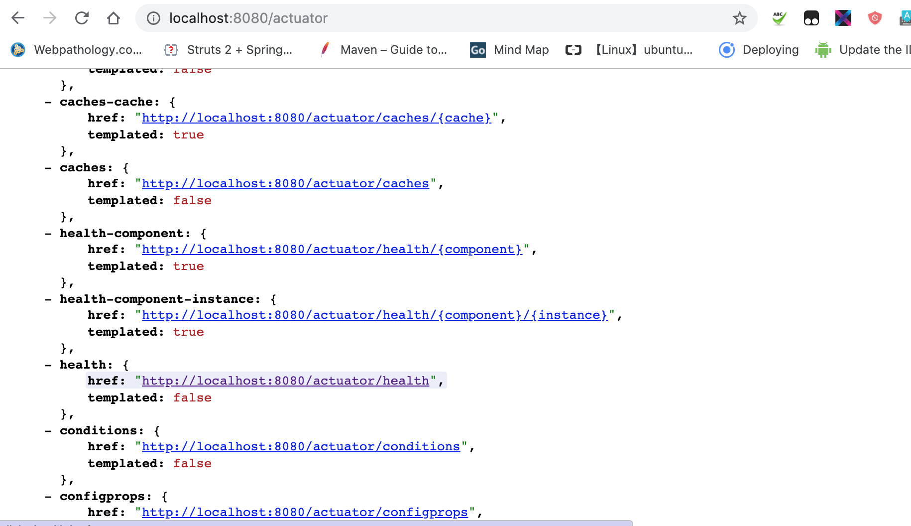
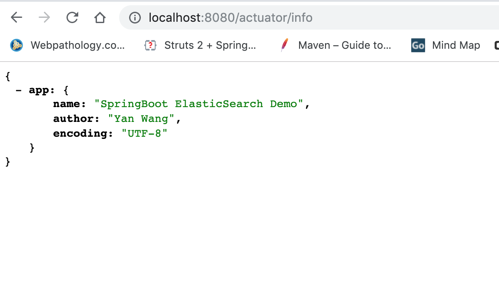
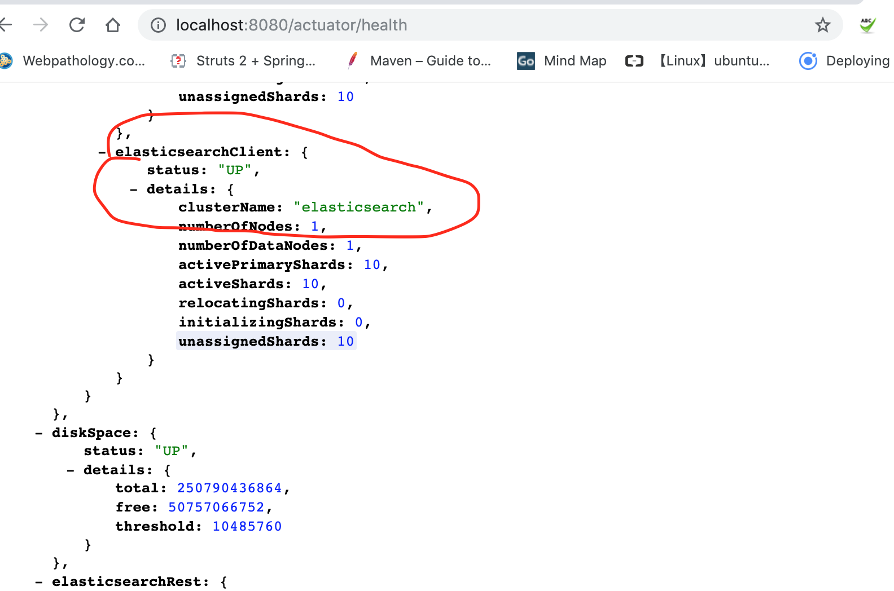
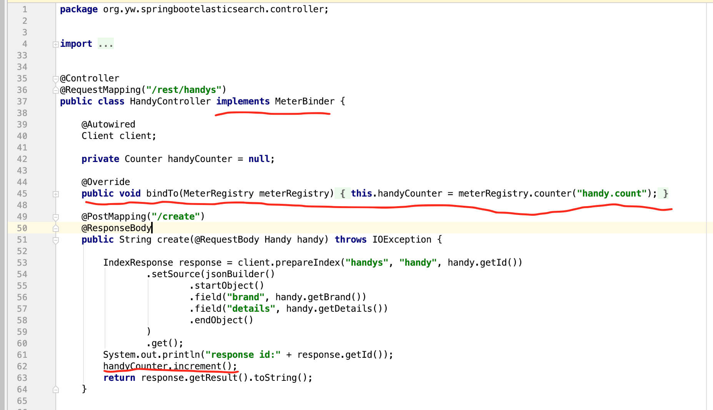
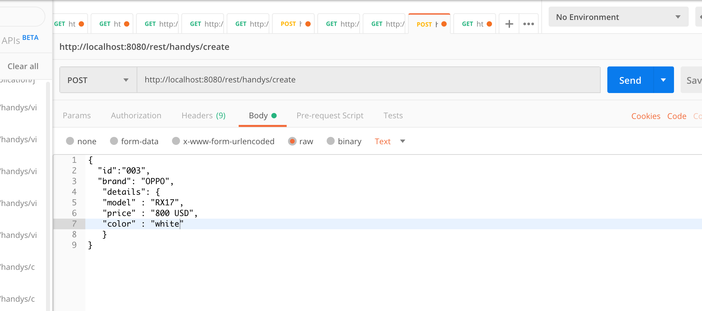
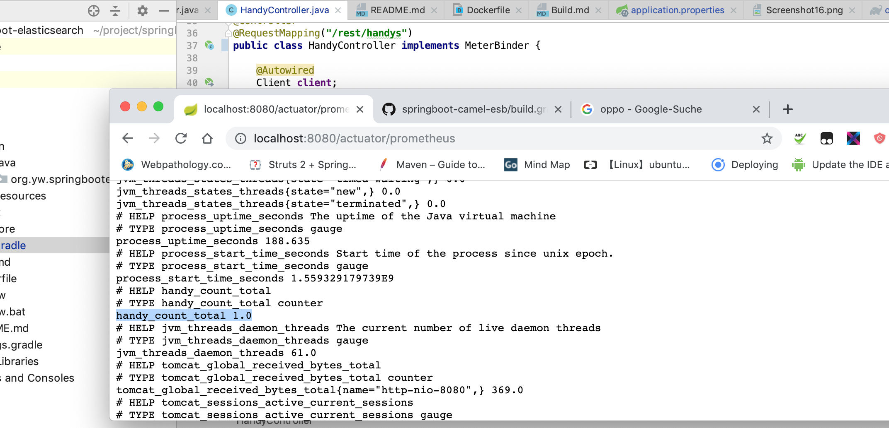
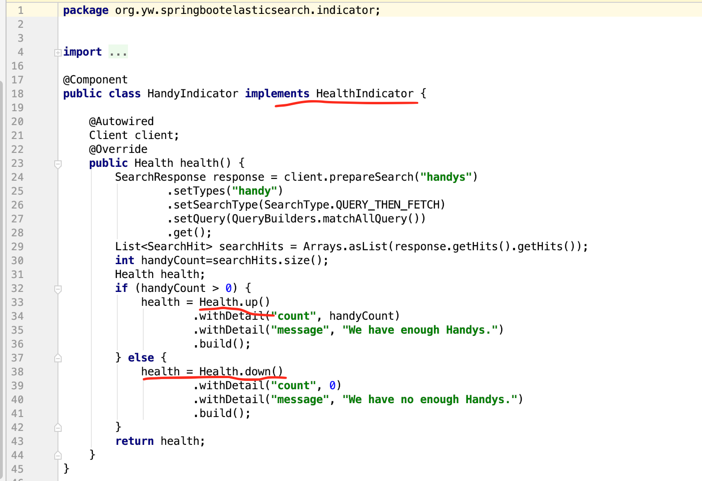
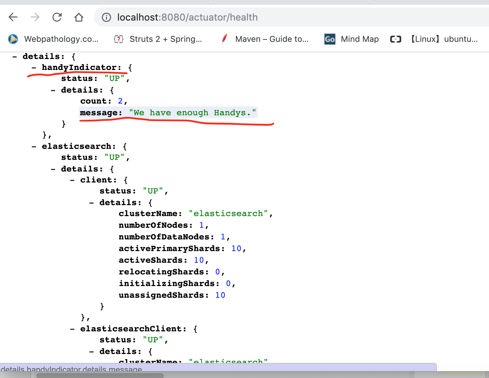

### Spring Boot Actuator 

This article shows you how to use Spring Boot Actuator to monitor your Application.

We will use SpringBoot+ElastichSearch as example , you can get all source code  at below link .
https://github.com/wangyan100/springbootexamples/tree/master/spring-boot-elasticsearch 

Spring Boot's Actuator provides many production-level features such as monitoring and measuring Spring Boot applications. These features of Actuator are available through numerous REST interfaces, remote shells, and JMX.

#### set up Actuator 

- import dependency  
  
  
- config Endpoint
  
  
- start elastichsearch and SpringBootApplication, you could use Actuator as below to monitor Application running status as below shown
  
  
- it shows application info, which is configured at application.properties
  
    
- it shows elasticsearch status , diskspace and so on. 
  

#### implement your own micrometer count

- create handyCounter, when create new handy method is called, handyCounter increases 1
  
  
- use Postman to invoke create new handy  REST method
  
  
- browse actuator prometheus endpoint, you can see handyCounter is 1 now
  
  
#### implement your own indicator to reflect Application health status
- create HandyIndicator, define Health Up and Health down based on handy numbers 
  

- use Postman to invoke create new handy REST method, then browse HandyIndicator Health status as below shown
  

