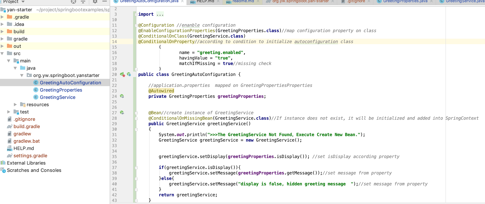

### Implement your own auto configuration 

SpringBoot starter is a core component. For example, if you use spring-boot-starter-web, then a lot of 
configurationes for web application will be done automaically for you. If you use spring-boot-starter-activemq, then a lot of activemq configuration will be done automatically as well.

When you use starter component, you don't need to do much about configuration, if there are some special configuration, you could just add them in application properties, then starter component can handle them correctly.

Here we use a demo to show you how to implement your own springboot starter to do auto configuration.

You basically just need do 5 things

- Create a your springboot starter template

- Write Java Config
     ```
     @Configuration
     ```
- Add condition
    ```
    @Conditional
    ```
- Locating Auto-configuration Candidates
    ```
    META-INF/spring.factories
    ````
- Integrate your springboot starter into another application.


#### Create a your springboot starter project
- add dependency 'org.springframework.boot:spring-boot-starter'
- add dependency 'org.springframework.boot:spring-boot-autoconfigure'
  
  
#### Write Java Config
- write Properties class
  

- write Service class
  
  
- write AutoConfiguration class
  

####  Locating Auto-configuration Candidates
- add META-INF/spring.factories
  

#### Integrate your springboot starter into the SpringBoot application.
- install your spring starter project into maven local repository as below shown
  
  
- add your springboot starter into the SpringBoot application
  
  
- add properties into the SpringBoot application's application.properties
  
  
- use aut configured Service class in the SpringBoot application as below shown
  
  
- run the SpringBoot application, it works
  

  


