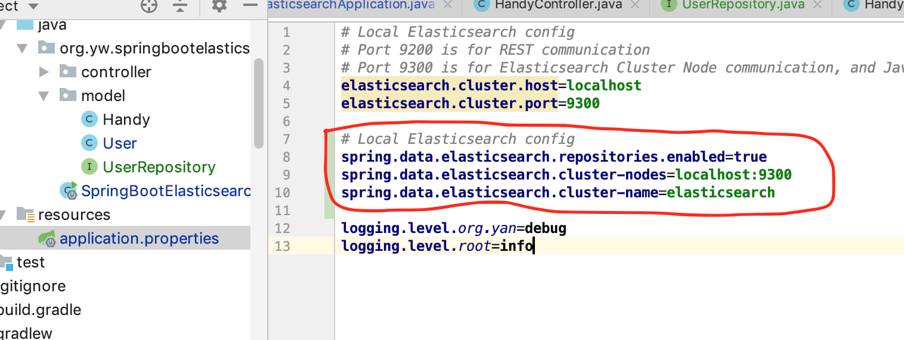
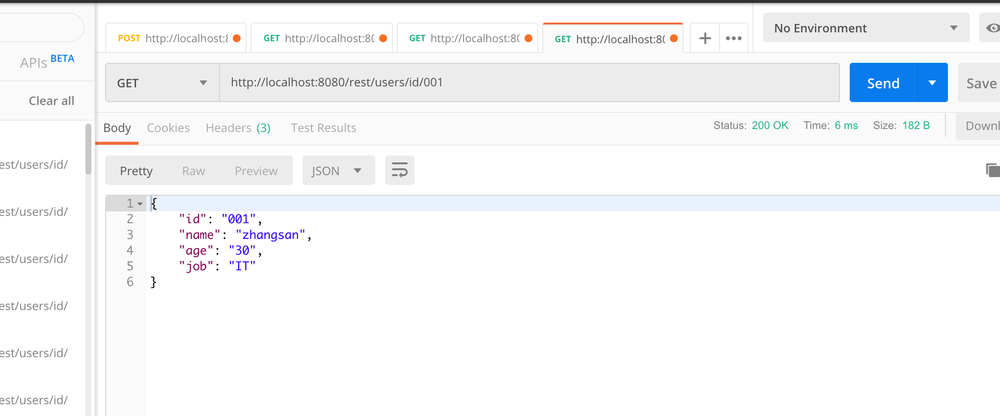
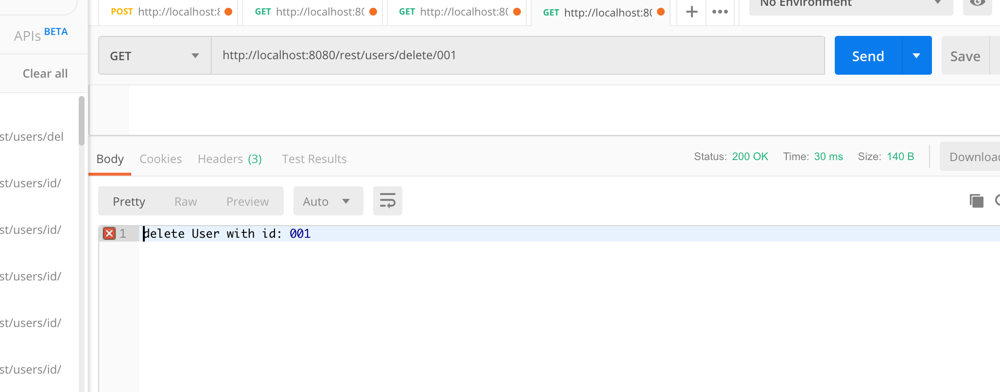
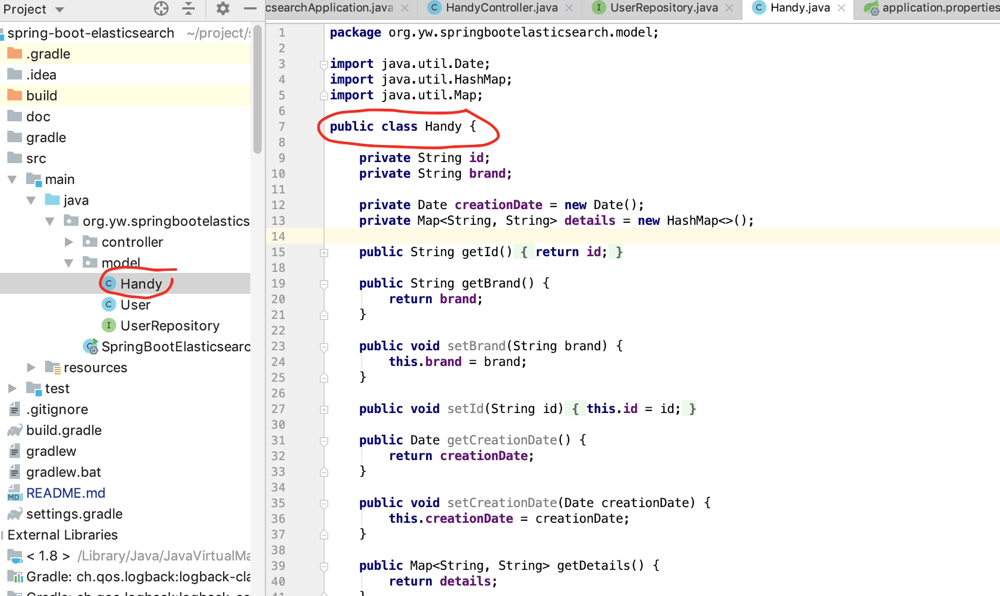
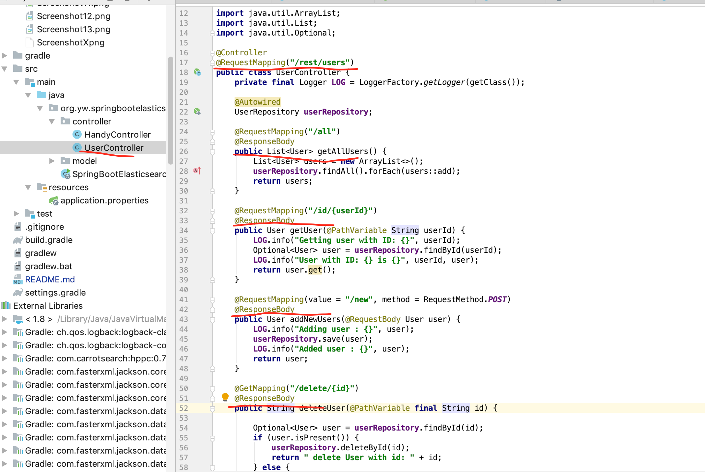
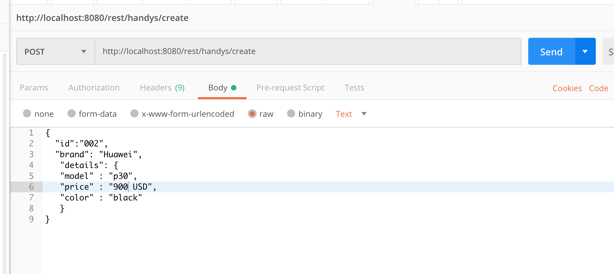

## Getting Started

This Example shows you how to use
ElasticsearchRepository , TransportClient to implement an SpringBoot + Elasticsearch CRUD Application

## Install elasticsearch 6.4.3 

- Download elasticsearch  6.4.3 (for spring2.1.4)
https://www.elastic.co/cn/downloads/elasticsearch

- Install it and run it, after it starts successfully, you could browse it like blow

###  ElasticsearchRepository CRUD 
- Create a SpringBoot Rest Application and set config for ElasticsearchRepository 
 

- Add User as data model 

- Add UserRepository as Data Repository

- Add UserController which autowiring UserRepository to implement CRUD functionality 

- Test ElasticsearchRepository CRUD functionality via REST 

  Add user

  List user

  Delete user

### Implement CRUD with TransportClient

- Set config for TransportClient

- Define Handy as data model 

- Create HandyController which autowiring Client to implement CRUD functionality 

- Add Handy

- View Handy

- Delete Handy

### Additional Links
These additional references should also help you:

- Elastic Search 
https://cloud.tencent.com/developer/article/1066239 

https://github.com/RajeshBhojwani/spring-boot-elasticsearch

https://dzone.com/articles/elasticsearch-with-spring-boot-application

https://dzone.com/articles/spring-boot-elasticsearch
https://github.com/RajeshBhojwani/spring-boot-standalone-elasticsearch/blob/master/src/main/java/com/example/elasticsearch/controller/UserController.java

https://piotrminkowski.wordpress.com/2019/03/29/elasticsearch-with-spring-boot/

http://localhost:8080/rest/handys/create

http://localhost:8080/rest/handys/view/001
Content-Type 
application/json

{
  "id":"001",
  "brand": "XiaoMi",
   "details": {
   "model" : "m8",
   "price" : "300 USD",
   "color" : "black"
   }
}